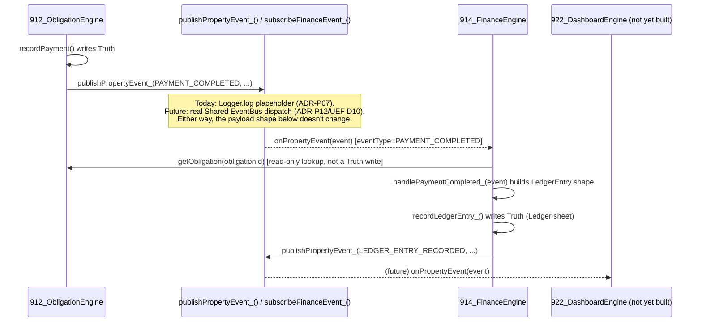

# Finance Engine — Vertical Slice (Contract Design)

**Module:** `914_FinanceEngine` (基础版 — Ledger, Cashflow, Analytics)
**Status:** Contract Design — **AWAITING REVIEW APPROVAL**, no Runtime code exists.
**Governs / governed by:** Constitution P1-P12, ADR-P01 (reaffirmed), ADR-P04, ADR-P06/P10, ADR-P07 (extended), ADR-P12 (this Engine's Architecture Decision), UEF v1.7 §2 Platform Constraints.

---

## 1. Business Rules

- Ledger entries are **derived from Domain Events**, never created ad-hoc by a user bypassing the event trail — Finance Engine's only source of truth *about what happened* is the events other Engines publish (ADR-P01). A future "manual cash entry not tied to any Obligation" feature is deliberately **not** in this base version — nothing has asked for it yet (avoid Speculative Design); when it's needed, it's an additive Command, not a redesign.
- Every Ledger entry, once recorded, is **immutable** (ADR-P06/P10 applied to a new Aggregate) — corrections happen via a **new, compensating entry** that references the original, never by editing or deleting a row.
- **Amount is always stored positive.** Direction is conveyed by `TransactionType` (`Expense`/`Income`), never by a signed number — avoids the classic ambiguity of "is this negative because it's a refund, or because someone typed it wrong."
- A payment reversal (`PAYMENT_REVERSED`) does not remove or edit the original Ledger entry it offsets — it creates a new entry with `IsReversal=true`, referencing the original via `ReversalOfLedgerId`. The *net* effect on any cashflow query is correct (the pair cancels out); the *history* of both the original charge and its reversal stays visible, which a straight edit or delete would destroy.
- Every Ledger entry carries full traceability back to its origin: `SourceEventType` + `SourceEventId` + `SourceReferenceId`. No Ledger entry should ever exist that can't be traced to a specific Domain Event.
- Category is **inherited from the source event** where one exists (a Mortgage payment's Ledger entry carries `Category='Mortgage'`, reusing `PROPERTY_CONFIG.OBLIGATION_CATEGORIES` — Finance Engine does not invent a second, parallel category taxonomy for anything Obligation Engine already categorizes). New categories are added only for sources Obligation Engine doesn't cover (e.g., `PropertySale`).
- Finance Engine **never maintains its own schedule** (ADR-P01, reaffirmed at ADR-P12) — it has no recurring logic of its own; every entry is a reaction to something that already happened elsewhere.
- Finance Engine **never reads or writes another Engine's Truth Layer directly** (ADR-P12) — not even temporarily to work around the EventBus gap. Its only inputs are event payloads shaped per §4.

## 2. Domain Model

- **Aggregate Root:** `LedgerEntry` — even simpler than Property's: no internal sub-entity, and (see §7) no lifecycle to guard, since an entry's state never changes after creation. A correction is a *new* Aggregate instance, not a transition of an existing one.
- **Value Objects reused:** `Money` (Amount). No new VOs needed for this base version.
- **Ownership:** 914 is the sole writer of the Ledger sheet (P3). Every other Engine that will eventually read Ledger data (922 Dashboard, future Cashflow Forecast/Investment Scoring in Phase 4) treats it as read-only.
- **Boundary:** Finance Engine's Aggregate boundary stops at recording *what happened financially* and answering queries about it. It does not decide *whether* a payment should happen (that's Obligation Engine) or *what a property is worth* (that's Property Asset Engine's `CurrentValue`) — it only records the transaction history and computes derived totals from that history.
- **Relationship to Obligation/Property Engines:** one-directional. 912/910 publish events; 914 reacts. 914 never calls back into 912/910's Commands. This one-directional flow is what keeps ADR-P01 true even while the EventBus is a placeholder (ADR-P12) — 914's Adapter receives event-shaped payloads; it doesn't reach backward to ask 912/910 anything.

## 3. Truth Layer Schema

### Entity: `LedgerEntry`

| Field | Type | Notes |
|---|---|---|
| LedgerID | string (PK) | `LEDG-{ts36}-{rand4}` |
| PropertyID | string, FK | which property this transaction relates to |
| TransactionType | enum | `Expense` \| `Income` |
| Category | string | inherited from source event where applicable (§1); `PropertySale` for property-sale-sourced entries |
| Amount | number | always positive (§1) |
| TransactionDate | ISO date | when the underlying transaction occurred (not when the Ledger entry was recorded) |
| SourceEventType | string | one of `PROPERTY_EVENTS` — which event produced this entry |
| SourceEventId | string | the originating event's `eventId`, for traceability |
| SourceReferenceId | string | the OccurrenceID/PropertyID/etc. the source event was about |
| IsReversal | boolean | true if this entry offsets an earlier one |
| ReversalOfLedgerId | string, FK, optional | set only when IsReversal=true |
| Note | string, optional | |
| CreatedAt | datetime | when this Ledger entry itself was recorded |

**Validation:** `Amount > 0`; `TransactionType ∈ {Expense, Income}`; if `IsReversal=true`, `ReversalOfLedgerId` must reference an existing LedgerEntry.
**Index:** PropertyID, TransactionDate, Category.
**dateColumns (plain-text protection, same fix as Obligation's/Property's):** TransactionDate, CreatedAt.

## 4. Event Contract

### Consumed (via `subscribeFinanceEvent_()` — placeholder Adapter, ADR-P12)

| Event | Relevant payload fields | Resulting Ledger effect |
|---|---|---|
| `PAYMENT_COMPLETED` | obligationId, occurrenceId, effectiveDue, amount, paidDate, paidVia | New Expense entry, Category from the Obligation Rule's Category (looked up via `getObligation`, read-only cross-Engine query — not a Truth write, so this doesn't violate §1's "never write another Engine's Truth Layer") |
| `PAYMENT_REVERSED` | obligationId, occurrenceId, originalEventId, reversedAmount, reason | New Income-signed offsetting entry, `IsReversal=true` — see §1: stored as `TransactionType='Income'` with the same Category, not a negative Expense, so a same-Category sum still nets correctly without needing signed arithmetic |
| `PROPERTY_SOLD` | propertyId, soldDate, soldPrice | New Income entry, `Category='PropertySale'` |
| `PROPERTY_SALE_REVERSED` | propertyId, originalEventId, reason | New Expense-signed offsetting entry, `IsReversal=true`, `Category='PropertySale'` |

### Published

| Event | Payload | Consumer |
|---|---|---|
| `LEDGER_ENTRY_RECORDED` | `{ledgerId, propertyId, transactionType, category, amount, transactionDate}` | 922_DashboardEngine (not yet built), future Analytics (Phase 4) |

All publishing goes through the existing `publishPropertyEvent_()` Adapter — no new publishing infrastructure decision here, per ADR-P07.

## 5. Command Contract

Unlike 912/910, Finance Engine's primary entry points are **event handlers**, not user-invoked Commands — there is no `/finance_record` Telegram command in this base version; nothing creates a Ledger entry except a reaction to another Engine's event. The Command Contract here is the internal shape those handlers share:

| Function | Role |
|---|---|
| `onPropertyEvent(event)` | The actual subscriber entry point — what `subscribeFinanceEvent_()` registers (today: called directly wherever it's wired per Runtime §; later: registered with the real Shared EventBus). Routes by `event.eventType`; ignores types it doesn't recognize rather than erroring, since new event types will be added by other Engines over time and Finance Engine shouldn't break when it sees one it doesn't yet handle. |
| `handlePaymentCompleted_(event)` | Translates a `PAYMENT_COMPLETED` payload into a Ledger entry shape, looks up Category via `getObligation()` (read-only), calls `recordLedgerEntry_`. |
| `handlePaymentReversed_(event)` | Translates `PAYMENT_REVERSED` into a compensating entry. |
| `handlePropertySold_(event)` | Translates `PROPERTY_SOLD` into an Income entry. |
| `handlePropertySaleReversed_(event)` | Translates `PROPERTY_SALE_REVERSED` into a compensating entry. |
| `recordLedgerEntry_(input)` | The one low-level write Command every handler above funnels through — validates, writes the Truth row, publishes `LEDGER_ENTRY_RECORDED`. Single top-level lock (`withFinanceLock_`), same pattern as 912/910. |

No `updateLedgerEntry`/`deleteLedgerEntry` Command exists, on purpose (§1 immutability).

## 6. Query Contract

| Query | Filters | Notes |
|---|---|---|
| `queryLedgerEntries(filters)` | propertyId?, from?, to?, category?, transactionType? | Basic listing, same shape as 912's `queryUpcomingPayments` |
| `queryCashflowSummary(propertyId, from, to)` | date range | Returns `{totalIncome, totalExpense, net}`, **computed at query time** from `queryLedgerEntries` results — not a stored running balance. Same Derived State reasoning as Obligation's Overdue status (UEF EP4): a stored balance is a second source of truth that can drift; summing on read never can. |

Nothing more elaborate (category breakdowns, trend charts, forecasting) is in this base version — that's Phase 4 (Cashflow Forecast, Investment Scoring) territory, built on top of this Ledger once it exists, not designed speculatively now.

## 7. Ledger Contract

Distinct from the Command Contract above — this is what a Ledger entry itself *guarantees* to anything that reads it, independent of how it got created:

1. **Immutability** — once `CreatedAt` is set, no field ever changes (§1).
2. **Full traceability** — `SourceEventType`/`SourceEventId`/`SourceReferenceId` are always populated; a Ledger entry with no traceable source is a contract violation, not a valid state.
3. **Positive amounts only** — `Amount > 0` always; direction is `TransactionType`, never sign.
4. **Reversals are pairs, not edits** — a reversed transaction is represented by *two* rows (original + `IsReversal=true` counter-entry), both permanently visible; `queryCashflowSummary` nets them correctly, `queryLedgerEntries` shows both.
5. **Property-scoped** — every entry belongs to exactly one `PropertyID`. Multi-property transactions (e.g., a single insurance policy covering two properties) are out of scope for this base version — not something doc1 or CC has asked for; would need its own design pass if it comes up.

## 8. State Machine

**None.** A `LedgerEntry` has exactly one state: it exists, immutably, from the moment it's created. There is no transition to guard — the entire "correction" mechanism is creating a *new* Aggregate instance (a reversal entry), not moving an existing one between states. Explicitly noted as "not applicable" rather than silently omitted, since CC's section list called for considering it.

## 9. Sequence Diagram

## 10. Migration Strategy

Additive-only, same pattern as 901's existing sheets: a new `Ledger` sheet, new columns only ever appended at the end, `dateColumns` plain-text protection applied identically to `PurchaseDate`/`EffectiveDue`'s fix. No existing sheet (ObligationRules/Occurrences/History, Properties) is touched by 914's Runtime. Rollback is simply: stop calling into 914 (nothing else depends on the Ledger sheet existing yet, since Dashboard/Analytics don't exist either) — no compatibility risk to any already-running Engine.

## 11. Test Plan (design only — Runtime + actual tests follow Review Approval, same sequencing as 910)

Same 8-category shape as Obligation Engine's, sized to what this Engine actually has:

- **Unit:** `recordLedgerEntry_` validation (Amount>0, TransactionType enum, IsReversal/ReversalOfLedgerId consistency).
- **Contract:** each of the 4 consumed event types → correct Ledger shape; `LEDGER_ENTRY_RECORDED`'s own required-field check.
- **State Transition:** N/A (§8) — no test category needed, noted rather than silently skipped.
- **Replay:** replaying all Ledger entries for a Property reconstructs the same `queryCashflowSummary` total as computed fresh — mirrors 912's Replay Test.
- **Integration (contract-level):** Dashboard's future consumption of `LEDGER_ENTRY_RECORDED` — shape-only, since 922 doesn't exist yet (same honest scoping as 912's Reminder/Finance Integration tests were before 914 existed).
- **AI Query:** `queryLedgerEntries` filtering, `queryCashflowSummary` correctness across a mixed Income/Expense/reversal sequence.
- **Migration:** adding a new Category (e.g., a future `RentalIncome`) doesn't break existing rows — same source-editing verification technique as Obligation Engine's.
- **Platform verification (ADR-P10 categories, adopted project-wide):** Replay ✓ (above), Failure Recovery — `recordLedgerEntry_`'s own post-Truth-write step (the `LEDGER_ENTRY_RECORDED` publish) gets the same `logFinancePartialFailure_`-style loud labeling as 912/910's Commands (UEF v1.6 §2/D9 applied here too, not re-derived).

## 12. Architecture Review (Self-Review)

| Check | Result |
|---|---|
| Follows Constitution/Blueprint/UEF | ✅ |
| ADR-P01 (Finance subscribes, doesn't schedule) | ✅ Reaffirmed at ADR-P12; no schedule of its own anywhere in this design |
| ADR-P04 (Event-driven payment flow) | ✅ Payment Completed → Event → Finance → (future) Dashboard, exactly as specified |
| ADR-P06/P10 (Event Immutability) | ✅ Reversal = new compensating Aggregate instance, never an edit |
| ADR-P07 (Adapter isolation) | ✅ Extended to the consuming side (`subscribeFinanceEvent_()`), same isolation guarantee as the publishing side |
| ADR-P12 (this Engine's Architecture Decision) | ✅ No direct Truth Layer access to 912/910 (only a read-only Query call to `getObligation` for Category lookup — explicitly not a Truth *write*, consistent with §1) |
| Avoids Speculative Design | ✅ No manual entry Command, no multi-property splitting, no forecasting/analytics beyond a query-time sum — all explicitly deferred with a reason |

**Open items needing CC's confirmation before Runtime:**
1. Is looking up `getObligation()` for Category inheritance (§4/§12) an acceptable **read-only** cross-Engine call, or should Finance Engine instead require the source event to carry Category directly (meaning 912's `PAYMENT_COMPLETED` payload would need a `category` field added)? Both are workable; the second avoids any cross-Engine call at the cost of a small Event Contract change to an already-running Engine.
2. `PROPERTY_SALE_REVERSED`'s compensating entry is modeled as `TransactionType='Expense'` (offsetting the original Income) — confirm this reads correctly for future tax/capital-gains reporting, or if `PropertySale` reversals deserve their own semantics distinct from ordinary Expense.

---

*Two open items, both narrow. Once confirmed, Runtime follows the same pattern as 910/912: Commands + event handlers, Node-shim self-check, then GAS-native tests against the same dedicated test spreadsheet.*
