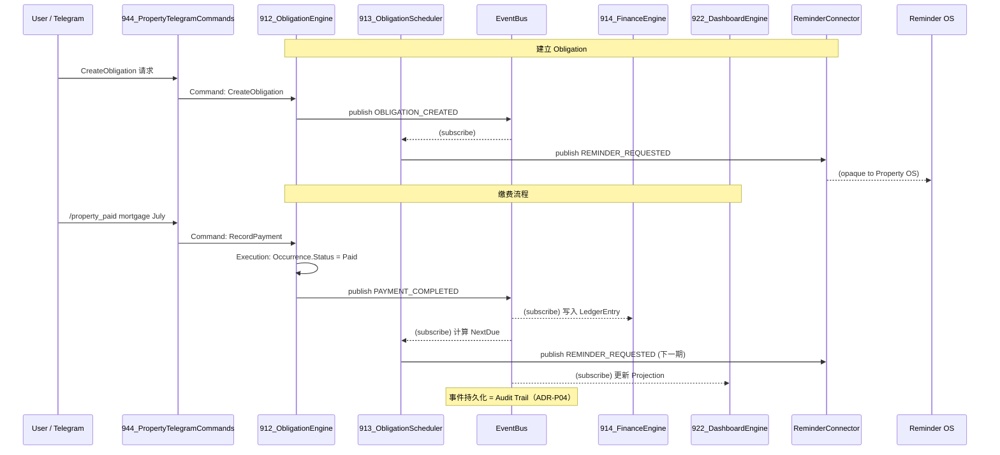

# Obligation Engine — Vertical Slice (Contract Design)

**Modules covered:** `912_ObligationEngine`, `913_ObligationScheduler`
**Status:** ✅ **APPROVED (2026-07-19)** — Architecture Review passed. This document is the baseline spec for Session 1 Runtime. Amended same day to incorporate ADR-P06 (Event Immutability), which was adopted at approval time — see §4, §5, §9, §14 for the additions.
**Governs:** ADR-P01, ADR-P02, ADR-P04, ADR-P05, ADR-P06 (see `00_ADR_Log.gs`)

---

## 1. Business Rules

### 付款规则 (Payment Rules)
- 每笔 `ObligationOccurrence` 只能被标记 `Paid` 一次；重复 `RecordPayment` 呼叫是幂等 no-op（见 §5, §11）。
- Paid 记录必须包含 `PaidDate`、`PaidAmount`、`PaidVia`（Manual / Import / API — 对应 ADR-P05 的摄入来源）、`Evidence`（可选，指向 Document）。
- `PaidAmount ≠ Amount` 时允许（部分缴费 / 超额缴费），但标记 `PartialPayment` / `OverPayment` 供 931_ObligationAnomalyDetector 消费，不视为错误。

### Recurring Rule
- `Frequency ∈ {Weekly, Monthly, Quarterly, Half-Yearly, Yearly, Custom}`。
- `Custom` 需显式 `CustomIntervalDays`（先支援固定天数间隔；Cron 表达式留待未来，不在本次范围）。
- `NextDue` 由 913_ObligationScheduler 依日历规则推算（月/季/年用日历月份加减，非固定天数累加，避免"每 30 天"造成的月份漂移）。

### Overdue Rule
- **Overdue 是衍生状态（derived），不是存储状态。** 底层 `Status` 只会被写入 `Draft / Active / Paid / Cancelled` 四种值；当 `Status = Active` 且 `today > effectiveDue + GraceDays` 时，任何读取路径（Dashboard/Query/AI）即时判定为"显示为 Overdue"。
  这个设计选择直接回应 ADR-P02 的延伸限制——**Property OS 不允许建立任何 Trigger**，因此不能用"每日排程扫描并写入 Overdue 状态"的做法，改为 Lazy Computation。
- `GraceDays`（默认 0，可于 Rule 层级覆写）：`DueDate + GraceDays` 内缴费不计入 Overdue 计算。

### Status
见 §9 State Machine（Rule 层级与 Occurrence 层级分开设计）。

### Frequency
见上方 Recurring Rule。

### Reminder Policy
- 默认 Offset：`[30, 14, 7, 3, 1, 0, -1, -3, -7]`（正数=提前天数，0=Due Today，负数=逾期后天数）。
- 可在 `ObligationRule` 层级覆写（per-obligation custom offsets）。
- `AutoGenerate = false` 时，Scheduler 不自动产生下一期 Occurrence（用于一次性或需人工确认的义务）。

---

## 2. Truth Layer Schema

### Entity: `ObligationRule`（Aggregate Root）

| Field | Type | Notes |
|---|---|---|
| ObligationID | string (PK) | `OBL-{ts36}-{rand4}` |
| PropertyID | string (FK) | → Properties |
| LoanID | string (FK, optional) | 仅 Category=Mortgage 时使用 |
| LeaseID | string (FK, optional) | 仅 Category=Rental Collection 时使用 |
| Category | enum | 见 900_PropertyConfig 完整清单（ADR-P01） |
| Payee | string | |
| Amount | Money | `{amount, currency}` |
| Frequency | Frequency (VO) | 见 Domain Model §4 |
| DueAnchor | date | 首期到期日 / 计算基准 |
| ReminderPolicy | ReminderPolicy (VO) | |
| AutoGenerate | boolean | |
| GraceDays | integer | 默认 0 |
| EndDate | date (optional) | 有则该 Rule 有自然终止点（→ Completed，见 §9） |
| Status | enum | Draft / Active / Suspended / Cancelled / Completed |
| CreatedAt / UpdatedAt | datetime | |

**Validation:** `Amount.amount > 0`；`Category` 必须在枚举内；`Frequency.type=Custom` 时 `customIntervalDays` 必填且 > 0。
**Index:** PropertyID, Category, Status, （供 913 扫描用）NextDue（衍生自最新 Occurrence，非存储于 Rule 本身）。
**Lifecycle:** 见 §9。

### Entity: `ObligationOccurrence`（Aggregate 内部 Entity，不可独立存在）

| Field | Type | Notes |
|---|---|---|
| OccurrenceID | string (PK) | `OCC-{ts36}-{rand4}` |
| ObligationID | string (FK) | → ObligationRule |
| effectiveDue | date | **幂等键**：同一 ObligationID + effectiveDue 唯一，snapshot 不随 Rule 后续变更而改变 |
| Amount | Money | Rule 当时的金额快照 |
| Status | enum | Draft / Active / Paid / Cancelled（Overdue 为衍生，不存储） |
| PaidDate / PaidAmount / PaidVia / Evidence | — | 仅 Paid 时填入 |
| CreatedAt / UpdatedAt | datetime | |

**Validation:** `(ObligationID, effectiveDue)` 组合唯一（幂等保证，比照 Reminder OS 既有 effectiveDue snapshot 经验）。
**Index:** ObligationID, effectiveDue, Status。
**Lifecycle:** 见 §9。

### Entity: `ObligationHistory`（只读投影，append-only）

| Field | Type | Notes |
|---|---|---|
| HistoryID | string (PK) | `HIST-{ts36}-{rand4}` |
| OccurrenceID | string (FK) | |
| FromStatus / ToStatus | enum | |
| ChangedAt | datetime | |
| TriggeredBy | string | Command 或 Event 名称 |
| Note | string (optional) | |

**Validation:** 只能 `appendRow`，永不 `UPDATE`/`DELETE`——这本身就是 ADR-P04 "Audit" 环节在域内的具体实现。

---

## 3. Domain Model（Obligation Aggregate 的落地示范）

> 全局骨架见独立文件 `PropertyOS_DomainModel.md`。本节是该文件在 Obligation Aggregate 上的完整示范。

- **Aggregate Root:** `ObligationRule`
- **内部 Entity:** `ObligationOccurrence`（只能透过 Rule 的 Command 产生，例如 `CreateObligation` 建立首个 Occurrence，Scheduler 的内部逻辑建立后续 Occurrence）
- **只读投影（非 Aggregate 成员）:** `ObligationHistory`
- **Value Object:** `Money`, `Frequency`, `ReminderPolicy`（定义于全局 Domain Model §4，本 Aggregate 直接复用）
- **Invariant（Aggregate 内必须永远成立）:**
  1. 一个 `ObligationRule` 在任一时刻最多只有一笔 `Status ∈ {Active}` 的"当期" Occurrence（不可同时有两笔待缴）。
  2. `Occurrence.Status = Paid` 后不可逆转为其他状态。
  3. `effectiveDue` 一旦产生不可修改；需要"改期"时只能 Cancel 该 Occurrence 并让 Scheduler 重新产生。
- **Ownership:** `912_ObligationEngine` 独家拥有本 Aggregate 的写入权（P3）。
- **Boundary:** Aggregate 边界止于"是否已缴费"。缴费后的资金流向属于 Finance Engine 的 `LedgerEntry` Aggregate，两者以事件解耦，**不要求分布式事务**，允许最终一致。

---

## 4. Event Contract

统一 Envelope：
```
{ eventId, eventType, occurredAt, propertyId, obligationId, payload, version }
```

命名一律 UPPER_SNAKE_CASE（Constitution §6 v0.2 修正）。

| Event | Payload（核心字段） | Producer | Consumer |
|---|---|---|---|
| `OBLIGATION_CREATED` | 完整 Rule 字段 | 912 | 903(索引), 930, 922 |
| `OBLIGATION_UPDATED` | `{ObligationID, changedFields}` | 912 | 913(重算), 922 |
| `OBLIGATION_CANCELLED` | `{ObligationID, reason}` | 912 | 913(取消未来 Reminder), 922 |
| `OBLIGATION_PAUSED` / `OBLIGATION_RESUMED` | `{ObligationID, reason?}` | 912 | 913, 922 |
| `PAYMENT_COMPLETED` | `{ObligationID, OccurrenceID, effectiveDue, amount, paidDate, paidVia, evidence?}` | 912 | 914(Finance), 913(算下一期), 922, 931 |
| `PAYMENT_REVERSED` ★ADR-P06 | `{ObligationID, OccurrenceID, originalEventId, reversedAmount, reason}` | 912 | 914(反向 LedgerEntry), 922, 931 |
| `REMINDER_REQUESTED` | `{ObligationID, OccurrenceID, effectiveDue, offsets[]}` | 913 | Reminder OS（经 ReminderConnector，opaque） |
| `UTILITY_BILL_RECEIVED` | `{source, rawAmount, rawDueDate, category, documentId?}` | 945(未来) | 912（转换为 `OBLIGATION_UPDATED`） |

**`PAYMENT_OVERDUE` — ✅ CONFIRMED (Review Approval 2026-07-19)：不产生此事件。** Overdue 是 Derived State（见 §1），系统不主动发布 `PAYMENT_OVERDUE`；Reminder OS 依它已持有的 `effectiveDue`/`offsets` 自行判断并产生逾期通知，不需要 Property OS 额外宣告"现在变成 Overdue 了"。（此为 ADR-P02 Addendum 的落实。）

**`PAYMENT_REVERSED` — ADR-P06 新增的 Compensating Event。** 当一笔已 `Paid` 的 Occurrence 需要修正（金额错误、误缴等），一律不修改/删除原 `PAYMENT_COMPLETED` 事件，而是发布 `PAYMENT_REVERSED` 引用其 `originalEventId`。触发 Command 见 §5 `ReversePayment`；对状态机的影响见 §9。

**Validation:** 所有 Event 发布前必须通过 903_PropertyEventDefinitions 的 Schema 校验；缺少必填字段应在 Execution 阶段被拒绝，不允许发布不完整事件。

---

## 5. Command Contract

| Command | Input | Validation | Error | Idempotency |
|---|---|---|---|---|
| `CreateObligation` | PropertyID, Category, Payee, Amount, Frequency, DueAnchor, ReminderPolicy?, AutoGenerate?, GraceDays? | 见 §2 | `INVALID_CATEGORY`, `INVALID_FREQUENCY`, `PROPERTY_NOT_FOUND` | 呼叫端提供 `ClientRequestID`；重复 ID 直接回传原结果，不重复建立 |
| `UpdateObligation` | ObligationID, changedFields | 不可修改 Cancelled/Completed 的 Rule | `OBLIGATION_NOT_FOUND`, `OBLIGATION_IMMUTABLE` | 天然幂等（同样输入结果一致） |
| `RecordPayment` | ObligationID, OccurrenceID?(缺省取当前 Active), PaidAmount, PaidDate, PaidVia, Evidence? | Occurrence 须处于 Active（含衍生 Overdue 显示）才能转 Paid | `OCCURRENCE_ALREADY_PAID`, `OCCURRENCE_NOT_FOUND`, `OBLIGATION_CANCELLED` | 以 OccurrenceID 为幂等键；重复呼叫回传"已缴费"而非报错 |
| `CancelObligation` | ObligationID, reason | 不可撤销已 Paid 的 Occurrence（历史不可篡改），只阻止未来新 Occurrence | `ALREADY_CANCELLED` | 天然幂等 |
| `PauseObligation` | ObligationID, reason? | — | `ALREADY_PAUSED`, `ALREADY_CANCELLED` | 天然幂等 |
| `ResumeObligation` | ObligationID | — | `NOT_PAUSED` | 天然幂等 |
| `ReversePayment` ★ADR-P06 | OccurrenceID, reason | Occurrence 必须处于 `Paid`；不修改/删除原 `PAYMENT_COMPLETED`，只发布 `PAYMENT_REVERSED`（Compensating Event，见 §4） | `OCCURRENCE_NOT_PAID`, `ALREADY_REVERSED` | 以 OccurrenceID 为幂等键；已被 Reverse 过的 Occurrence 不可再次 Reverse（一次全额反转，不支援部分反转——若未来需要，属新的 Migration） |

---

## 6. Reminder Contract（介面定义，不实现 Runtime）

- **ReminderRequest**（Event Payload / Value Object）：`{ObligationID, OccurrenceID, effectiveDue, offsets[], suppressIfPaid: true}`
- **ReminderPolicy**：`{defaultOffsets: [30,14,7,3,1,0,-1,-3,-7], graceDays, perObligationOverride?}`
- **ReminderOffset**：单一整数；正数=提前 N 天，0=Due Today，负数=逾期后 N 天。
- **ReminderChannel**：由 Reminder OS 决定，Property OS 不指定（符合"不知道如何实现"）。
- **ReminderStatus**：Property OS 不追踪送达/已读状态。
- **取消责任 — ✅ CONFIRMED (Review Approval 2026-07-19)：归 Reminder OS。** Occurrence 变成 Paid/Cancelled 后，"取消尚未触发的提醒"由 Reminder OS 自行订阅 `PAYMENT_COMPLETED` / `OBLIGATION_CANCELLED` 等事件、自行判断 suppress；Property OS **不**发布任何取消信号，不承担取消逻辑。这与"Property OS 不知道 Reminder 如何实现"的精神一致——Property OS 只管发生了什么事实（付了/取消了），怎么处理提醒完全是 Reminder OS 的责任。
- **ReminderConnector Interface（草案）：**
  ```
  ReminderConnector.publish(ReminderRequest): Ack
  ```
  Property OS 只呼叫这一个方法；其余（取消/改期/送达确认）皆非 Property OS 关心范围。

---

## 7. Finance Contract

- **LedgerEntry**：`{LedgerID, PropertyID, ObligationID?(一次性支出为 null), Type(Income/Expense), Category, Amount, Date, SourceEvent, CreatedAt}`
- **CashFlowUpdate**：非独立 Command，是 LedgerEntry 新增触发的 Projection 重算（Query-side 概念）。
- **OutstandingBalance**：仅适用 Mortgage 类别，由 915_MortgageEngine 的 Amortization Schedule 提供，912/914 皆不重复计算，只透过 ObligationID 关联查询。
- **MonthlyExpense / AnnualExpense**：914 的 Projection，依 `LedgerEntry.Date` 聚合。
- **Analytics Input**：914 须暴露只读 Query（非 Command）供 931/932/933 读取聚合结果，不直接暴露 Ledger 原始表（保持封装）。

---

## 8. AI Query Contract

统一 Query Interface（Read-Only，不产生 Event，不需 User Confirmation）：

```
queryUpcomingPayments({propertyId?, from, to})     → 未来 N 个月有哪些付款
queryOverdue({propertyId?})                         → 哪些付款逾期（Lazy 计算）
queryCategoryTotal({propertyId?, category, from, to}) → 过去一年 Mortgage 总额 等
queryCashflowForecast({propertyId?, months})        → 未来现金流预测（依赖 932，advisory）
queryAnomalies({propertyId?})                       → 费用异常增加（依赖 931，advisory）
```

所有 Query 输出必须标注 `dataAsOf` 时间戳，并区分 `authoritative`（直接来自 Ledger/Occurrence）与 `advisory`（来自 Forecast/Anomaly）。

---

## 9. State Machine

### ObligationRule（是否产生新 Occurrence）

```
Draft → Active
Active ⇄ Suspended        (Pause / Resume Command)
Active/Suspended → Cancelled   [终态，显式用户操作]
Active/Suspended → Completed   [终态，EndDate 到达或 Loan 完全摊还等自然终止]
```
**Forbidden:** `Cancelled`/`Completed` → 任何其他状态（终态不可逆）。

### ObligationOccurrence（单期是否已缴费）

```
Draft(可选) → Active
Active → Paid       [终态，一般流程下不可逆]
Active → Cancelled  [终态，例：Rule 被取消时尚未缴费的 Occurrence]

★ ADR-P06 唯一例外：
Paid → Active   [仅能透过 ReversePayment Command 触发，
                 且必须同时发布 PAYMENT_REVERSED Compensating Event；
                 原 PAYMENT_COMPLETED 事件不删除、不修改]
```
`Overdue` **不是存储状态**，是 `Active` + `today > effectiveDue+GraceDays` 的即时衍生显示（见 §1）。

**Forbidden:** `Cancelled` → 任何其他状态（无例外）。`Paid` → 任何状态皆禁止，**除了**经由 `ReversePayment` 这一条明确、独立、留痕的路径——一般的 `RecordPayment` 或直接改字段的操作，永远不能逆转 `Paid`。这个例外之所以不违反"终态不可逆"的精神，是因为它本身不是"改动历史"，而是"追加一笔新的、承认历史+修正现况的事实"（Compensating Event），原始的 `PAYMENT_COMPLETED` 事件永远保持不变。

---

## 10. Sequence Diagram



---

## 11. Error Strategy

| 情境 | 处理方式 |
|---|---|
| Duplicate（对同一 OccurrenceID 重复 `RecordPayment`） | Idempotent no-op，回传既有结果，不报错 |
| Missing Payment（到期未缴） | 不是 Error——Lazy Computation 自动显示为 Overdue，属正常状态 |
| Late Payment（逾期后才缴费） | 允许；记录 `daysLate` 供 Analytics，不阻断 |
| Reminder Failure（Reminder OS 端送达失败） | 不属于 Property OS 错误处理范围（P4 边界）；Property OS 只需确保 `REMINDER_REQUESTED` 发布成功 |
| Cancelled Obligation（对已 Cancelled 呼叫 RecordPayment） | `OBLIGATION_CANCELLED_IMMUTABLE`，拒绝 |
| **Recovery Strategy** | 所有 Command 失败不改变任何 Truth 状态（Execution 层需 all-or-nothing）；EventBus 发布失败时整体回滚，不允许"Truth 写了但 Event 没发出"的不一致态 |

---

## 12. Migration Strategy

- **新增 Obligation Category：** 只需在 `900_PropertyConfig` 枚举新增值，Schema 结构不变。
- **新增 Frequency 类型：** 需扩充 913 的计算逻辑，Schema 不变（向后兼容）。
- **新增栏位（如未来 `TaxDeductible` flag）：** 走 Additive Migration——新增栏位、预设值回填旧资料、不删除旧栏位，并更新 `905_PropertyVersioning` 的 Schema Version。
- **原则：** 任何 Migration 不得要求重写既有 `ObligationHistory` 记录（Append-Only 不可篡改）。

---

## 13. Test Plan

| 类型 | 覆盖内容 |
|---|---|
| Unit Test | 每个 Command 的 Validation / Error 分支 |
| Contract Test | Event Payload 是否符合 §4 定义的 Schema |
| State Transition Test | §9 所有合法转换 + 所有 Forbidden Transition 必须回报错误 |
| Replay Test | 重放 EventBus 历史事件，验证 Projection（Ledger/Dashboard）可完全重建 —— 这是 Audit 可信度的根本保证 |
| Reminder Integration Test | 验证 `REMINDER_REQUESTED` 格式与 ReminderConnector 期望介面一致（Mock ReminderConnector） |
| Finance Integration Test | 验证 `PAYMENT_COMPLETED` 被 914 正确镜像为 `LedgerEntry` |
| AI Query Test | 每个 §8 Query 的边界案例（无资料/大量资料/跨物业） |
| Migration Test | 新增 Category/Frequency 后，旧资料仍可正确读取 |

---

## 14. Architecture Review（Self Review）

| 检查项 | 结果 |
|---|---|
| 符合 Constitution | ✅ P1-P9 皆有对应设计（P8/P9 直接源自本次 ADR-P04/P05） |
| 符合 Blueprint | ✅ Foundation(Schema/Identity/Event) → Runtime(Command/Event/Projection) → Intelligence(Query, advisory) → Integration(Reminder Contract) 分层清楚 |
| 符合 UEF | ✅ 本文件本身即 Contract Design 阶段产出，未越界进入 Implementation |
| 符合 Event Driven | ✅ 无任何 Command 直接写 Truth 而不发布 Event（ADR-P04） |
| 符合 Truth Layer 保护 | ✅ 无 AI 直写路径；Command 皆需明确输入（Telegram 指令或未来 UI 确认） |
| 符合 ADR | ✅ P01(唯一真相来源)/P02(Reminder 委派)/P04(Payment Event)/P05(不 Poll) 皆已落实 |
| 符合 Reminder OS 整合 | ⚠️ 机制设计完成，但 ReminderConnector 实际 API 覆盖率**尚未核实**（见 00_Project_State TECH DEBT #1）——诚实标注，不假装已验证 |
| 符合 Future Multi-Property | ✅ 所有 Entity 皆以 PropertyID 分区，Query 支援 propertyId 过滤 |
| 符合 Future Portfolio | ✅ Finance Contract 的 Analytics Input 为 942_InvestmentIntegrationAdapter 预留了聚合接口 |
| 符合 AI Governance | ✅ §8 Query 明确区分 authoritative/advisory；931/932 皆标注 advisory |
| 符合 ADR-P06 (Event Immutability) | ✅ `ReversePayment`/`PAYMENT_REVERSED` 是本文件唯一的"修正"路径；原事件永不修改/删除；State Machine 的 Paid→Active 例外已明确限定只能经此路径触发 |

**Review Approval (2026-07-19) 已解决的项目：**
1. ~~`PAYMENT_OVERDUE` 事件是否要保留~~ → CONFIRMED 不产生，Overdue 全为 Derived State。
2. ~~Reminder 取消责任归属~~ → CONFIRMED 归 Reminder OS。

**仍未能验证的项目（诚实列出，不回避）：**
1. ReminderConnector 是否已支援本文件 §6 定义的 Contract —— 需 CC 或有权限的 session 对照实际代码核实。这是 Session 1 Runtime 实作 913_ObligationScheduler 时必须先确认的前置事项，不属于本次 Review Approval 涵盖范围。

---

*本文件完成 Obligation Engine 完整 Vertical Slice，已通过 Architecture Review（2026-07-19），并同日修订以纳入 ADR-P06。本文件现为 Session 1 Runtime 实作的基准规范——Runtime 代码必须严格遵循本文件，不得擅自调整架构；若实作中发现规格缺口或矛盾，须停下报告，不能自行决定。*
