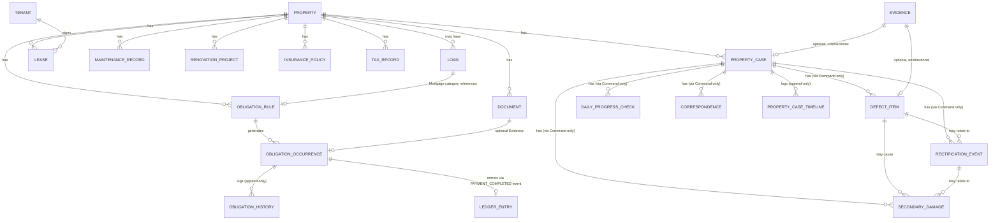

# Property OS — Domain Model

**Status:** v0.1 — Contract Design（不属于 Runtime，独立于任何 Engine 文件）
**目的：** 在任何 Engine 开始 Runtime 实作前，先固定整个 Property OS 的领域模型。所有 Engine（Asset/Obligation/Mortgage/Rental/Document/Maintenance/Defect/Renovation/Insurance/Tax/Finance）都必须围绕本模型扩展，避免未来大规模重构。

本文件遵守 `00_Project_Constitution.js`；如有冲突，以 Constitution 为准。

---

## 1. Bounded Context

Property OS 目前视为**单一 Bounded Context**，内部依 P3（Single Owner per Entity）切分为多个 Aggregate。跨 Context（与 Reminder OS / Investment OS / News OS）一律经 Connector，不在本模型讨论范围内。

---

## 2. Aggregates

每个 Aggregate 有且只有一个 Owning Engine（对应 Constitution §7）。Aggregate 之间**不允许跨界事务**——一致性靠 Event 达成最终一致，不使用分布式事务。

| Aggregate Root | Owning Engine | 内部 Entity | 说明 |
|---|---|---|---|
| `Property` | Property Asset Engine | — | 房产主档。2026-08-17 新增 `DevelopmentName`/`UnitLabel`（ADR-P17，Additive），`PropertyName` 保持自由文字不变 |
| `Loan` | Mortgage Engine | AmortizationSchedule（衍生，非存储） | 贷款条款 |
| `ObligationRule` | Obligation Engine | `ObligationOccurrence`（内部 Entity） | ADR-P01 唯一真相来源 |
| `Tenant` | Rental Engine | — | 租客身份，可跨多个 Lease/Property |
| `Lease` | Rental Engine | — | 单一租约，引用 TenantID |
| `Document` | Document Engine | — | 文件 + Metadata（规划中，未实现） |
| `Evidence` | Document Engine | — | 2026-08-17 新增（Phase 5，911_DocumentEngine，Runtime Complete）。`Document` 原规划的最小可用实作，不是完整 Document Library。复用 `DOC-` 前缀，与未来若真的做完整 `Document` 是同一条 ID 序列，不需要迁移 |
| `MaintenanceRecord` | Maintenance Engine | — | 单次维修 |
| `PropertyCase` | Defect Engine | `DefectItem`、`DailyProgressCheck`、`Correspondence`、`RectificationEvent`、`SecondaryDamage`（内部 Entity）；`PropertyCaseTimeline` 是只读投影 | 2026-08-17 新增（Phase 1-8，918_DefectEngine，Runtime Complete）。`CaseType` 目前只有 `'DLP'`——ADR-P15：不预先做通用 Case 抽象，等第二个真实 Case 类型出现才 promote，比照 UEF Candidate Pattern 两个独立案例的既有纪律 |
| `RenovationProject` | Renovation Engine | — | 单个装修项目 |
| `InsurancePolicy` | Insurance Engine | — | 保单 |
| `TaxRecord` | Tax Engine | — | 税务记录 |
| `LedgerEntry` | Finance Engine | — | 单笔收支交易（只能透过订阅事件产生，见 ADR-P01） |

`ObligationOccurrence` 不是独立 Aggregate——它必须透过 `ObligationRule` 的行为（Command）产生，不可脱离 Rule 单独存在或被外部直接建立。`ObligationHistory` 是 Occurrence 的只读投影（append-only audit trail），同样不是独立 Aggregate。

`DefectItem`/`DailyProgressCheck`/`Correspondence`/`RectificationEvent`/`SecondaryDamage` 全部适用同一条规则——必须透过 `PropertyCase` 的 Command 产生（`addDefectItem`/`logDailyProgressCheck`/`logCorrespondence`/`logRectificationEvent`/`logSecondaryDamage`），不可脱离 Case 单独存在或被外部直接建立。`PropertyCaseTimeline` 是这五者的只读投影（append-only），跟 `ObligationHistory` 同一个模式，只是横跨多种实体类型，不是独立 Aggregate。

**已知 Domain Model limitation，记入 ADR-P15，不是现在的待办**：`DefectItem.OwnerVerificationStatus`（及 `DeveloperStatus`）目前是 Aggregate 内部 Entity 上的单一栏位，不是归属于某一次具体维修周期。这在"Owner 判定 Failed 之后，Developer 重新宣称完成"这种情况下会留下语意落差（旧的 Failed 判定不会自动失效）。正确的长期解法是引入 **Repair Cycle / Verification Cycle** 作为 `DefectItem` 底下再一层的内部 Entity，让每次维修周期各自独立持有 Developer 声明与 Owner 判定。这次 Vertical Slice 刻意不做——两个独立、互相独立的状态栏位已经是新模式了，不在同一次里再叠加一层新的聚合层级，且目前只有一个真实案例，还没有第二个例子能证明这层拆分真的必要（同样的 Candidate Pattern 纪律）。

---

## 3. Cross-Aggregate Relationships（一律 ID 引用，不嵌套写入）

关键说明：
- `Property → Loan`：设计为 1-to-N（虽然典型情境是 1 个物业对 1 笔主贷款），以支援未来 Refinance 产生的历史贷款记录或 Second Mortgage。
- `Tenant → Lease`：Tenant 独立于 Lease，因为同一租客可能在不同时间承租不同物业，或续约产生新 Lease 记录。
- `ObligationOccurrence → LedgerEntry`：**单向、经事件、非同步外键**。LedgerEntry 不直接 FK 到 Occurrence 做强关联，而是记录 `SourceEvent` 作为可追溯来源（保持 Finance Engine 对 Obligation Engine 的解耦，符合 ADR-P01 的边界原则）。
- `Document → Occurrence`：Evidence 是可选关联，Document 本身不知道自己被哪些 Occurrence 引用（避免反向依赖）。
- `Evidence → PropertyCase / DefectItem`（2026-08-17 新增）：同一条"单向、不知道被谁引用"原则，直接沿用上面 `Document → Occurrence` 已经确立的模式，不是新发明。`Evidence` 另外还有一对通用栏位 `RelatedEntityType`/`RelatedEntityID`（未画进 ERD，属于同一张表内部栏位而非独立关联）可以指向 `DailyProgressCheck`/`Correspondence`/`RectificationEvent`/`SecondaryDamage` 里的任一笔，同样单向。
- `PropertyCase → DefectItem/DailyProgressCheck/Correspondence/RectificationEvent/SecondaryDamage`（2026-08-17 新增）：全部标注"via Command only"——这五者都不能被外部直接建立，只能透过 `PropertyCase` 自己的 Command（`addDefectItem` 等）产生，跟 `ObligationRule → ObligationOccurrence` 同一条既有规则。
- `RectificationEvent`（2026-08-17 新增）：append-only，CC Review Approval 2026-08-15 定案——每个维修里程碑是新的一行，用 `EventType` 区分，不是回头修改既有列。

---

## 4. Shared Value Objects

定义一次，供所有 Aggregate 使用（归属 Foundation 层，902/905 一带落实）：

| Value Object | 字段 | 不可变性 |
|---|---|---|
| `Money` | `{ amount, currency }` | 是；比较以值为准，不可用引用比较 |
| `DateRange` | `{ start, end }` | 是 |
| `Address` | `{ line1, line2, city, state, postcode, country }` | 是 |
| `GeoPoint` | `{ lat, lng }` | 是 |
| `Frequency` | `{ type: Weekly\|Monthly\|Quarterly\|Half-Yearly\|Yearly\|Custom, customIntervalDays? }` | 是 |
| `ReminderPolicy` | `{ offsets: number[], graceDays }` | 是 |

Value Object 的核心特征：无独立身份（no ID），两个字段相同即视为相等，任何"修改"都是整体替换而非局部 mutation。

---

## 5. Global Invariants（跨 Aggregate 皆必须成立）

1. 每个 Entity 只能有一个 owning Engine 写入（P3）。
2. Aggregate 之间不允许跨界事务；一致性靠 Event 达成最终一致（P1）。
3. 所有 ID 全局唯一且不可重用，由 `902_PropertyIdentity` 统一分配。
4. 任何 Aggregate 的终态（Paid / Cancelled / Completed 等，视各自 State Machine 定义）一旦达成即不可逆转——需要"撤销"时一律建立新记录，不修改历史记录（Append-Only 精神，支撑 Audit）。**已记录的例外（2026-08-17，ADR-P15，CC Review Approval）**：`DefectItem.DeveloperStatus` 与 `DefectItem.OwnerVerificationStatus` 不是这个意义上的终态栏位——`OwnerVerificationStatus` 尤其可以在 `FailedVerification`/`PartiallyVerified` 之后被重新评估（Developer 再次尝试维修后重新 verify）。真正保留 Append-Only/Audit 精神的是 `PropertyCaseTimeline`——每次变更都在那里留下一行新纪录，只是"当下值可以被重新设定"这件事本身跟 Invariant #4 原本设想的场景（Paid/Sold 那种一次性、单向的终态）不同。`DefectItem.Status`（三个状态栏位里的总览栏位）在 `Closed` 这个终态上仍然遵守 Invariant #4——只有 `closeDefectItem`/`reopenDefectItem` 两个专属 Command 能跨越这个边界，跟 `markPropertySold`/`reversePropertySale` 同一个模式。
5. AI 生成的衍生字段（Score、Insight、OCRText、AINotes）不属于任何 Aggregate 的 Invariant 保护范围——它们是 advisory，允许被重算/覆盖，不受 Aggregate 一致性规则约束（呼应 P5）。

---

## 6. 各 Engine 的扩展责任

未来新增 Engine 或扩充既有 Engine 时，**必须先检查本文件**：

- 新 Entity 属于哪个 Aggregate？是否需要新增 Aggregate Root？
- 是否需要新增跨 Aggregate 关联？关联方向是否符合"ID 引用、不嵌套"原则？
- 是否引入了新的 Value Object？是否可复用 §4 既有的？
- 是否违反 §5 的任一 Global Invariant？

若上述任一项的答案会改变本文件内容，视为 Documentation Drift，须同步更新本文件（对应 Constitution §10 的同步规则，本文件虽独立于三大治理文件，但适用相同原则）。

---

## 7. 已规划但尚未实现的扩展（见 `00_Product_Backlog.js` 完整设计草图）

Property Aggregate 未来会扩充以下内容——这里只记它们如何融入本文件已有的骨架，完整设计理由见 Backlog 本身：

- **LeaseExpiryYear**（BL-1）— `Property` Aggregate 自身新增栏位，不是新 Entity，不影响 §2 的 Aggregate 表。`RemainingLeaseYears` 不落库，查询时衍生（同 §5 Global Invariant 的 Derived State 精神）。
- **PropertyInsurancePolicy**（BL-2）— 新 Entity，但**不是**独立管理排程的 Aggregate；透过 `ObligationID` 关联到 Obligation Aggregate 的一笔 `ObligationRule`（Category='Insurance'），复用 912 既有的 Reminder/Overdue/Payment 机制，只补充 Obligation Schema 装不下的保险专属描述资料（保险公司、保单号、承保类型/金额）。关联方向：`PropertyInsurancePolicy.ObligationID → ObligationRule`，符合本文件"ID 引用、不嵌套"的原则。
- **PropertyManagementContact / PropertyManagementPhone**（BL-3）— 两个新 Entity，一对多关联（一个 Contact 可以有多个 Phone，各自标记类型），都透过 `PropertyID` 关联回 Property Aggregate，不新增 Value Object（电话号码就是字串+enum 类型栏位，不需要专门的 VO）。

三者都不违反 §5 任一 Global Invariant，加入时本节需要同步更新为"已实现"并搬移细节到对应 Vertical Slice / File Map。

---

*本文件与 `ObligationEngine_VerticalSlice.md` §2（Truth Layer Schema）§3（Domain Model）互为细化关系：本文件是全局骨架，Vertical Slice 文件是 Obligation Aggregate 的完整落地示范。*
