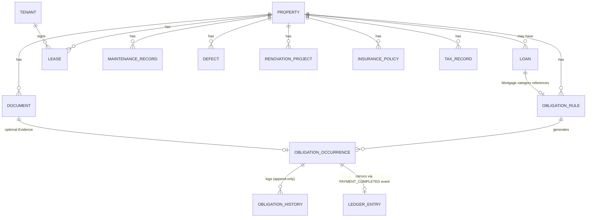

# Property OS — Domain Model

**Status:** v0.1 — Contract Design（不属于 Runtime，独立于任何 Engine 文件）
**目的：** 在任何 Engine 开始 Runtime 实作前，先固定整个 Property OS 的领域模型。所有 Engine（Asset/Obligation/Mortgage/Rental/Document/Maintenance/Defect/Renovation/Insurance/Tax/Finance）都必须围绕本模型扩展，避免未来大规模重构。

本文件遵守 `00_Project_Constitution.js`；如有冲突，以 Constitution 为准。

---

## 1. Bounded Context

Property OS 目前视为**单一 Bounded Context**，内部依 P3（Single Owner per Entity）切分为多个 Aggregate。跨 Context（与 Reminder OS / Investment OS / News OS）一律经 Connector，不在本模型讨论范围内。

---

## 2. Aggregates

每个 Aggregate 有且只有一个 Owning Engine（对应 Constitution §7）。Aggregate 之间**不允许跨界事务**——一致性靠 Event 达成最终一致，不使用分布式事务。

| Aggregate Root | Owning Engine | 内部 Entity | 说明 |
|---|---|---|---|
| `Property` | Property Asset Engine | — | 房产主档 |
| `Loan` | Mortgage Engine | AmortizationSchedule（衍生，非存储） | 贷款条款 |
| `ObligationRule` | Obligation Engine | `ObligationOccurrence`（内部 Entity） | ADR-P01 唯一真相来源 |
| `Tenant` | Rental Engine | — | 租客身份，可跨多个 Lease/Property |
| `Lease` | Rental Engine | — | 单一租约，引用 TenantID |
| `Document` | Document Engine | — | 文件 + Metadata |
| `MaintenanceRecord` | Maintenance Engine | — | 单次维修 |
| `Defect` | Defect Engine | — | VP/Defect 记录 |
| `RenovationProject` | Renovation Engine | — | 单个装修项目 |
| `InsurancePolicy` | Insurance Engine | — | 保单 |
| `TaxRecord` | Tax Engine | — | 税务记录 |
| `LedgerEntry` | Finance Engine | — | 单笔收支交易（只能透过订阅事件产生，见 ADR-P01） |

`ObligationOccurrence` 不是独立 Aggregate——它必须透过 `ObligationRule` 的行为（Command）产生，不可脱离 Rule 单独存在或被外部直接建立。`ObligationHistory` 是 Occurrence 的只读投影（append-only audit trail），同样不是独立 Aggregate。

---

## 3. Cross-Aggregate Relationships（一律 ID 引用，不嵌套写入）

关键说明：
- `Property → Loan`：设计为 1-to-N（虽然典型情境是 1 个物业对 1 笔主贷款），以支援未来 Refinance 产生的历史贷款记录或 Second Mortgage。
- `Tenant → Lease`：Tenant 独立于 Lease，因为同一租客可能在不同时间承租不同物业，或续约产生新 Lease 记录。
- `ObligationOccurrence → LedgerEntry`：**单向、经事件、非同步外键**。LedgerEntry 不直接 FK 到 Occurrence 做强关联，而是记录 `SourceEvent` 作为可追溯来源（保持 Finance Engine 对 Obligation Engine 的解耦，符合 ADR-P01 的边界原则）。
- `Document → Occurrence`：Evidence 是可选关联，Document 本身不知道自己被哪些 Occurrence 引用（避免反向依赖）。

---

## 4. Shared Value Objects

定义一次，供所有 Aggregate 使用（归属 Foundation 层，902/905 一带落实）：

| Value Object | 字段 | 不可变性 |
|---|---|---|
| `Money` | `{ amount, currency }` | 是；比较以值为准，不可用引用比较 |
| `DateRange` | `{ start, end }` | 是 |
| `Address` | `{ line1, line2, city, state, postcode, country }` | 是 |
| `GeoPoint` | `{ lat, lng }` | 是 |
| `Frequency` | `{ type: Weekly\|Monthly\|Quarterly\|Half-Yearly\|Yearly\|Custom, customIntervalDays? }` | 是 |
| `ReminderPolicy` | `{ offsets: number[], graceDays }` | 是 |

Value Object 的核心特征：无独立身份（no ID），两个字段相同即视为相等，任何"修改"都是整体替换而非局部 mutation。

---

## 5. Global Invariants（跨 Aggregate 皆必须成立）

1. 每个 Entity 只能有一个 owning Engine 写入（P3）。
2. Aggregate 之间不允许跨界事务；一致性靠 Event 达成最终一致（P1）。
3. 所有 ID 全局唯一且不可重用，由 `902_PropertyIdentity` 统一分配。
4. 任何 Aggregate 的终态（Paid / Cancelled / Completed 等，视各自 State Machine 定义）一旦达成即不可逆转——需要"撤销"时一律建立新记录，不修改历史记录（Append-Only 精神，支撑 Audit）。
5. AI 生成的衍生字段（Score、Insight、OCRText、AINotes）不属于任何 Aggregate 的 Invariant 保护范围——它们是 advisory，允许被重算/覆盖，不受 Aggregate 一致性规则约束（呼应 P5）。

---

## 6. 各 Engine 的扩展责任

未来新增 Engine 或扩充既有 Engine 时，**必须先检查本文件**：

- 新 Entity 属于哪个 Aggregate？是否需要新增 Aggregate Root？
- 是否需要新增跨 Aggregate 关联？关联方向是否符合"ID 引用、不嵌套"原则？
- 是否引入了新的 Value Object？是否可复用 §4 既有的？
- 是否违反 §5 的任一 Global Invariant？

若上述任一项的答案会改变本文件内容，视为 Documentation Drift，须同步更新本文件（对应 Constitution §10 的同步规则，本文件虽独立于三大治理文件，但适用相同原则）。

---

*本文件与 `ObligationEngine_VerticalSlice.md` §2（Truth Layer Schema）§3（Domain Model）互为细化关系：本文件是全局骨架，Vertical Slice 文件是 Obligation Aggregate 的完整落地示范。*
